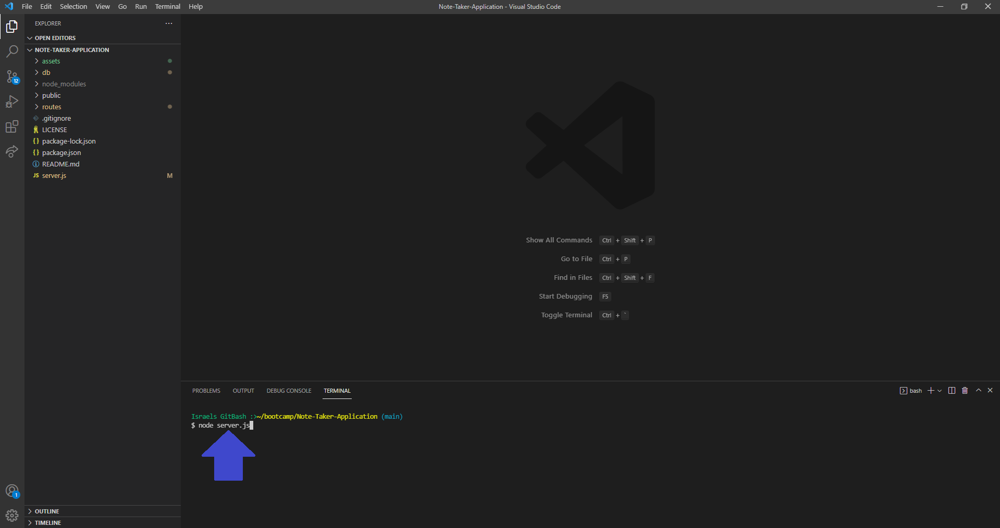
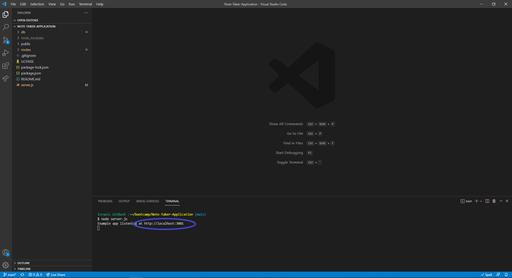
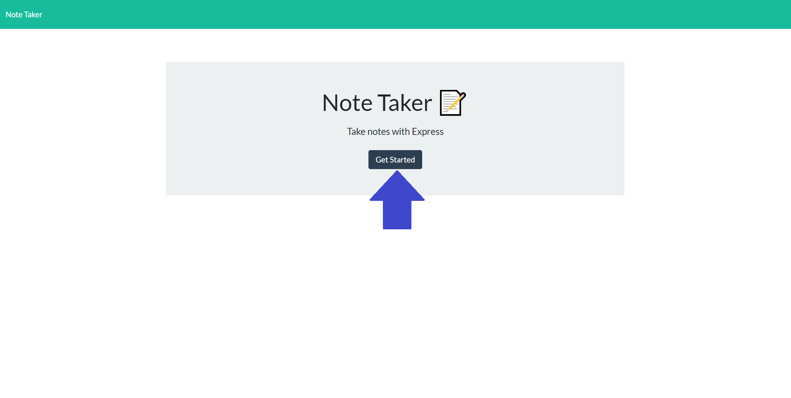
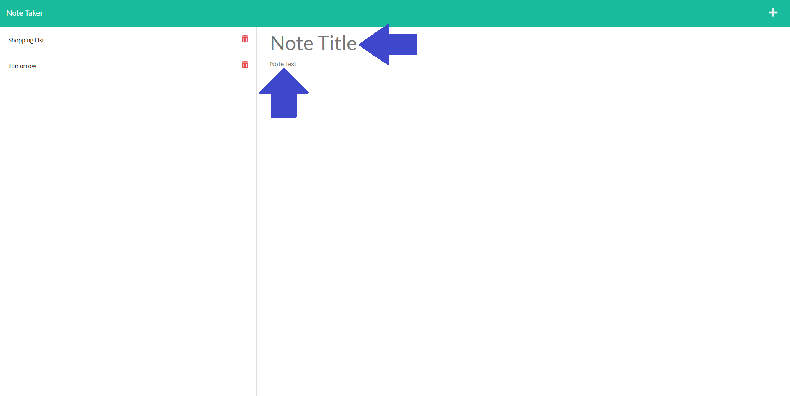
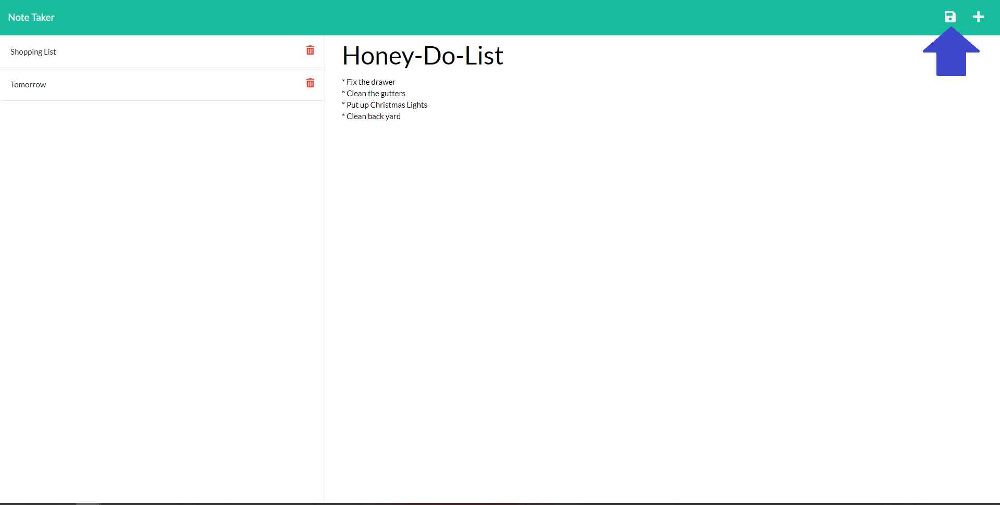
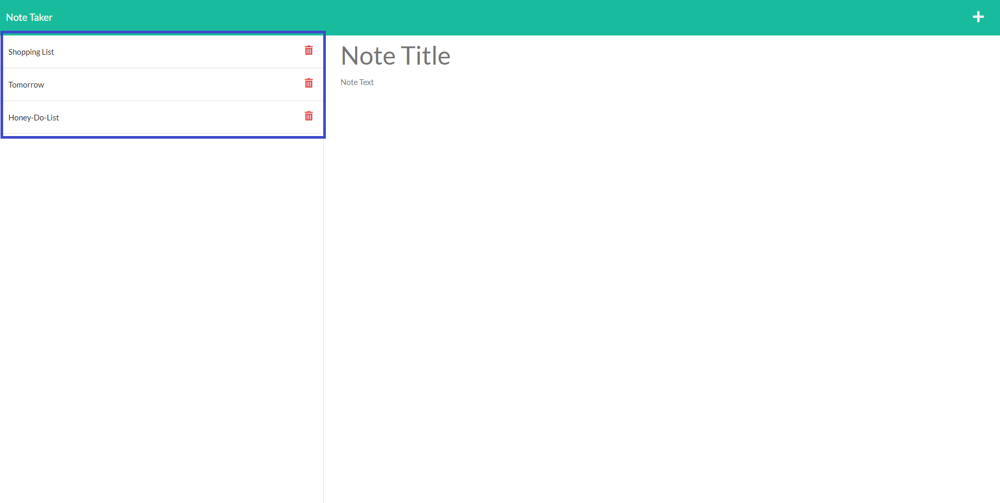
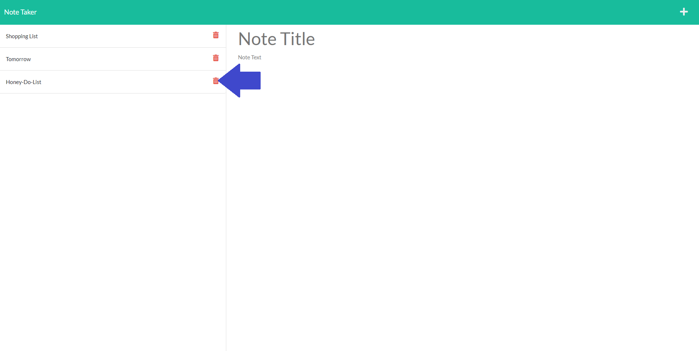
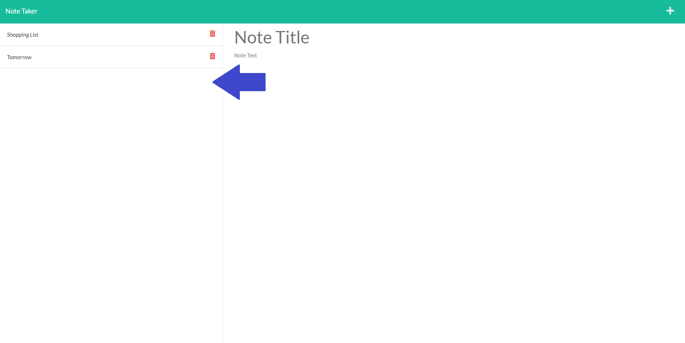

# Note-Taker-Application


## Description
This application uses Express.js back end to save and review note data from a JSON file. When you arrive to the landing page you'll be presented with a "Getting Started" button. After clicking the button your be able to see any previous notes entered and enter new entries. This application was created to help small business owners write and save notes in order to organize their thoughts and to keep track of tasks needing to be completed.

This project allowed me to continue practice using NodeJS. I learned how to connect the back end to a database file and how to use GET/POST requests. I also learned how to use Heroku to deploy server based applications.

## Table of Contents
- [Installation](#installation)
- [Usage](#usage)
- [Contributing](#contributing)
- [Questions](#questions)
- [License](#license)

## Installation
How to install this application and getting started:

* Clone the repo to your local machine
* Open the integrated terminal for the server.js file
* Run `npm install --y` which will install any dependencies

## Usage
You can find the deployed application by clicking on this link https://shrouded-lake-77408.herokuapp.com/.

### Step 1
* Invoke the following command on your integrated terminal:

```bash
node server.js
```


### Step 2
* After the command has been intered in the terminal you will see a message with the localhost. Click on the localhost link to visit the server site.



### Step 3
* You will see the landing page of the Note Taker Application. Click "Get Started".



### Step 4
* You will be routed to the note page. On the left you will see any previous notes saved and on the right you will be able to enter a new note. Enter a Note Title and the text for the note. After entering the note Click the "Save" icon.




### Step 5
* After entering your note you will see it has been added to the list of notes on the left.



### Step 5
* To delete a note click on the "trash" icon next to the note you want to delete. After clicking on the "trash" icon you will see the note has been removed.




## Contributing
There are many ways in which you can participate in this project, for example:

* Submit bugs and feature requests
* Review source code changes
* Review the documentation and make pull requests for anything from typos to additional and new content

## Questions
To find more information and the repository on this project please visit my [GitHub](https://github.com/israelmrios).

For any additional questions please email me [here](mailto:israelm.riosjr@gmail.com).

## License
Copyright (c) 2021 Israel M Rios.
Licensed under the [MIT License](LICENSE).